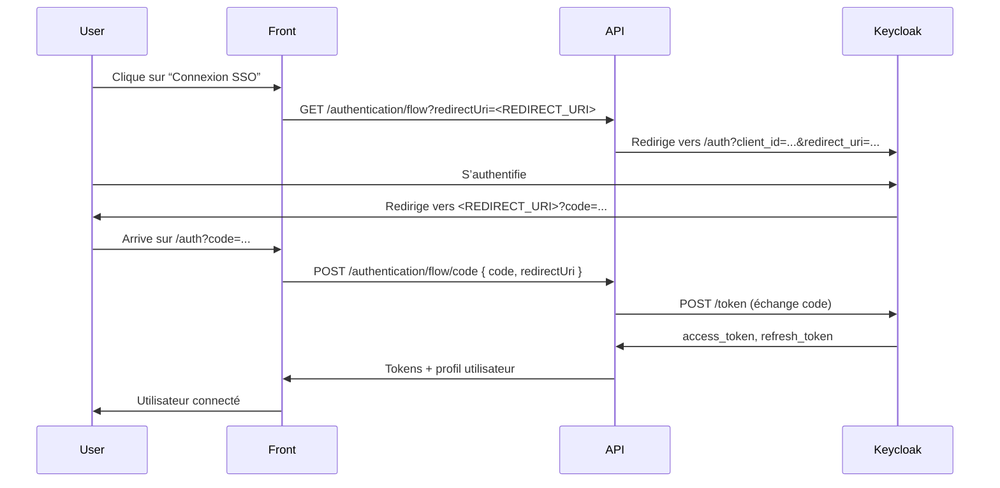

# Documentation SSO & Workflow d’Authentification

## 1. Principe général

Le projet utilise **Keycloak** comme fournisseur d’identité (IdP) et le protocole **OpenID Connect (OIDC)** pour gérer le SSO (Single Sign-On) entre l’application (mobile/web) et le backend.
Le SSO permet à un utilisateur de s’authentifier via son établissement (ou un IdP central) et d’accéder à l’application sans créer de nouveau mot de passe.

---

## 2. Étapes du workflow SSO

### A. Initiation du SSO (Front → API → Keycloak)

1. **L’utilisateur clique sur “Connexion SSO”** dans l’application.
2. Le front appelle l’API :
    ```
    GET /authentication/flow?redirectUri=<REDIRECT_URI>
    ```
    - `<REDIRECT_URI>` est l’URL vers laquelle Keycloak doit rediriger l’utilisateur après authentification (ex : `http://localhost:8100/auth`).
3. L’API construit l’URL d’auth Keycloak :
    ```
    http://<KEYCLOAK_BASE_URL>/realms/<REALM>/protocol/openid-connect/auth?client_id=<CLIENT_ID>&redirect_uri=<REDIRECT_URI>&response_type=code&scope=openid offline_access email profile
    ```
4. L’utilisateur est redirigé vers Keycloak.

---

### B. Authentification sur Keycloak

5. **L’utilisateur s’authentifie** sur Keycloak (avec son compte universitaire ou via un IdP externe si configuré).
6. **Keycloak redirige l’utilisateur** vers le `<REDIRECT_URI>` fourni, en ajoutant un paramètre `code` dans l’URL :
    ```
    <REDIRECT_URI>?code=<AUTHORIZATION_CODE>
    ```

---

### C. Échange du code contre un token (Front → API → Keycloak)

7. Le front détecte le paramètre `code` dans l’URL (ex : `/auth?code=...`).
8. Le front appelle l’API pour échanger ce code contre un access token :
    ```
    POST /authentication/flow/code
    Body: { code: <AUTHORIZATION_CODE>, redirectUri: <REDIRECT_URI> }
    ```
9. L’API appelle Keycloak :
    ```
    POST /realms/<REALM>/protocol/openid-connect/token
    Body (x-www-form-urlencoded):
      - code: <AUTHORIZATION_CODE>
      - grant_type: authorization_code
      - client_id: <CLIENT_ID>
      - client_secret: <CLIENT_SECRET>
      - redirect_uri: <REDIRECT_URI>
      - scope: openid offline_access email profile
    ```
10. **Keycloak valide le code** et retourne :
    - `access_token`
    - `refresh_token`

---

### D. Récupération du profil utilisateur

11. L’API utilise l’`access_token` pour récupérer le profil utilisateur (endpoint `/userinfo` ou API interne).
12. Le front stocke les tokens et l’utilisateur est connecté.

---

## 3. Points d’attention

-   **Le code d’autorisation est à usage unique et très court (60s par défaut).**
-   **Le `redirect_uri` doit être strictement identique** entre l’initiation et l’échange du code.
-   **Les redirect URIs doivent être autorisées** dans la configuration du client Keycloak.
-   **Les attributs personnalisés** (ex : `universityId`, `universityLogin`) sont injectés dans les tokens via les protocol mappers Keycloak.

---

## 4. Schéma du workflow



---

## 5. Résumé des endpoints principaux

-   **/authentication/flow** (GET)
    → Génère l’URL d’auth Keycloak (initiation SSO)
-   **/authentication/flow/code** (POST)
    → Échange le code d’autorisation contre un token
-   **/realms/<realm>/.well-known/openid-configuration**
    → Découverte OIDC (utilisé par l’API pour trouver les endpoints Keycloak)

---

## 6. Gestion des erreurs courantes

-   **invalid_grant: Code not valid**
    → Code déjà utilisé, expiré, ou mauvais `redirect_uri`
-   **invalid redirect_uri**
    → L’URL n’est pas autorisée dans Keycloak
-   **Problème de provisioning**
    → À la première connexion, Keycloak peut prendre un peu plus de temps à créer l’utilisateur

---

## 7. Personnalisation et attributs

-   Les attributs comme `universityId` et `universityLogin` sont ajoutés dans les tokens via les protocol mappers Keycloak.
-   Ils sont utilisés côté API pour rattacher l’utilisateur à son université et gérer les droits.

---

## 8. Conseils de debug

-   Toujours vérifier la correspondance exacte du `redirect_uri`.
-   Logger le code d’autorisation et le `redirect_uri` côté front et API.
-   Vérifier les logs Keycloak en cas d’erreur.

---
