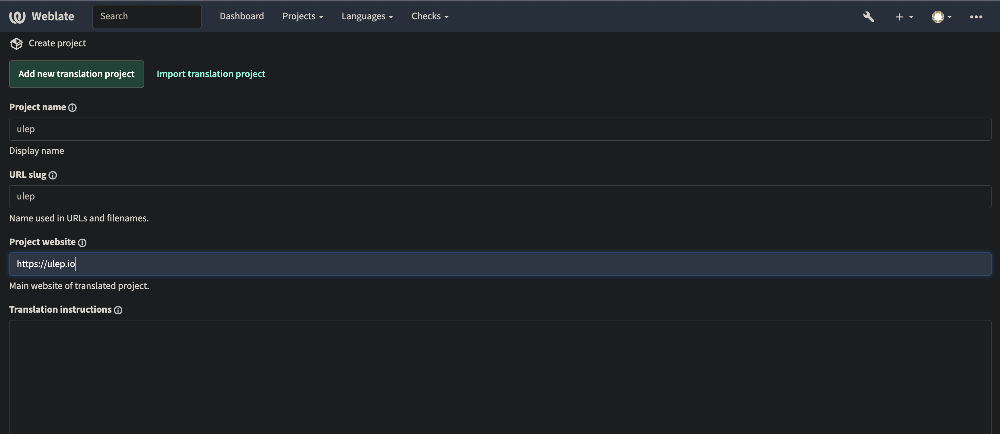
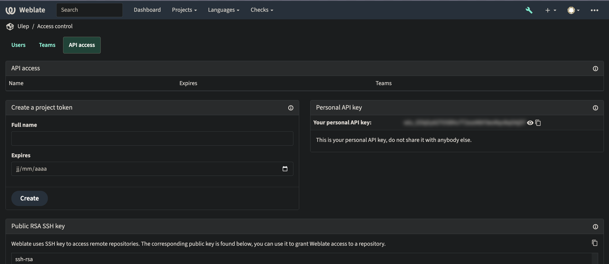
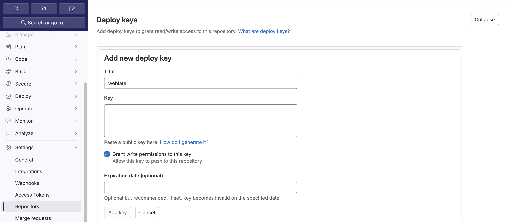
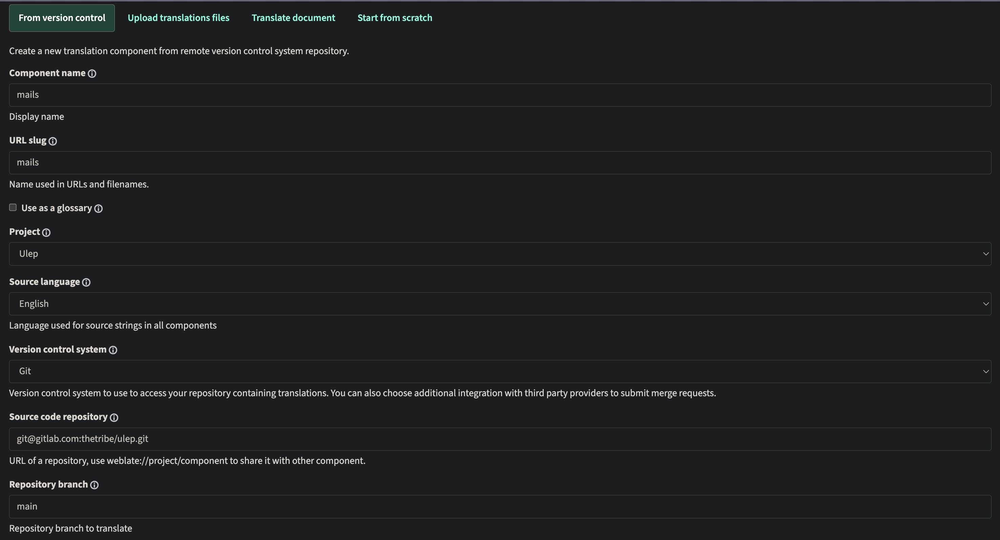
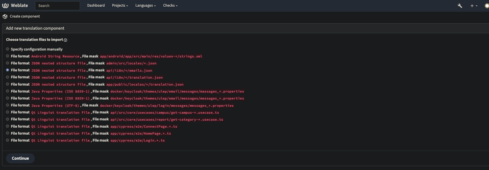
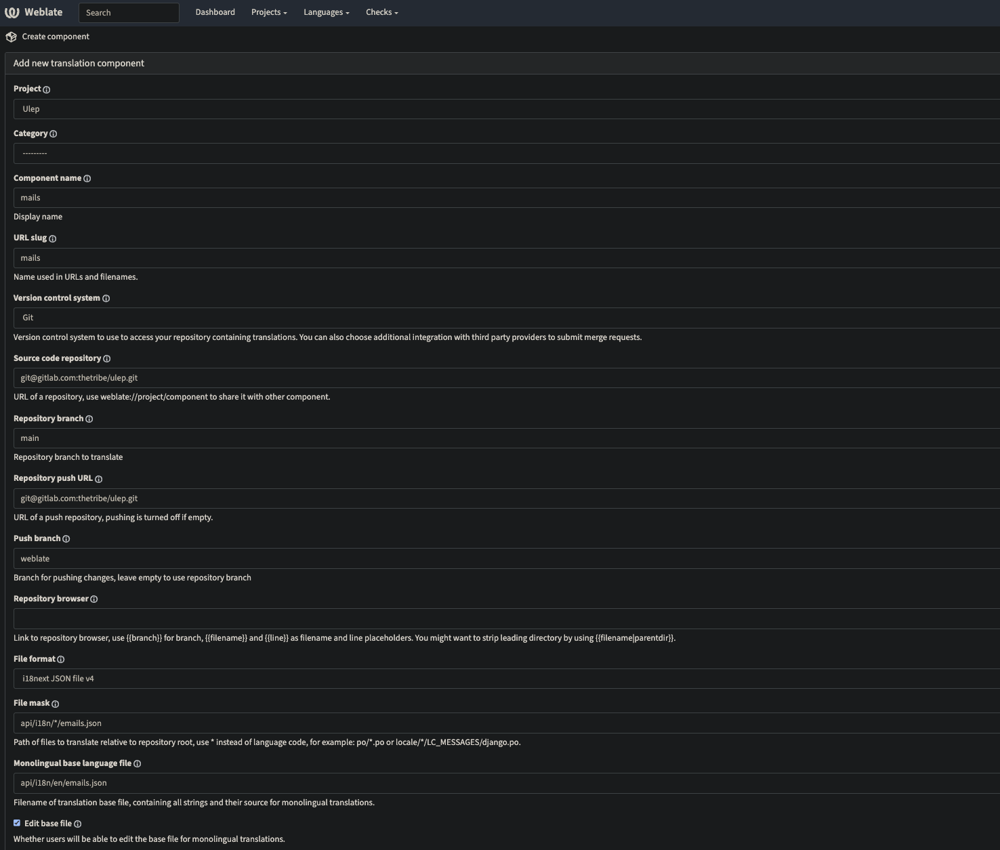
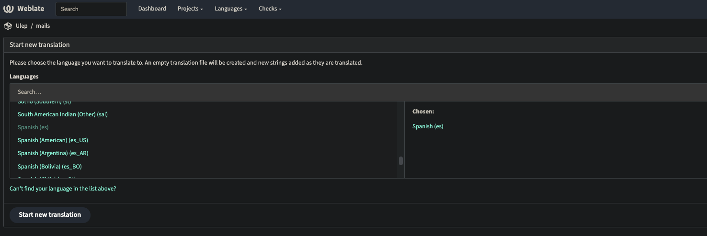
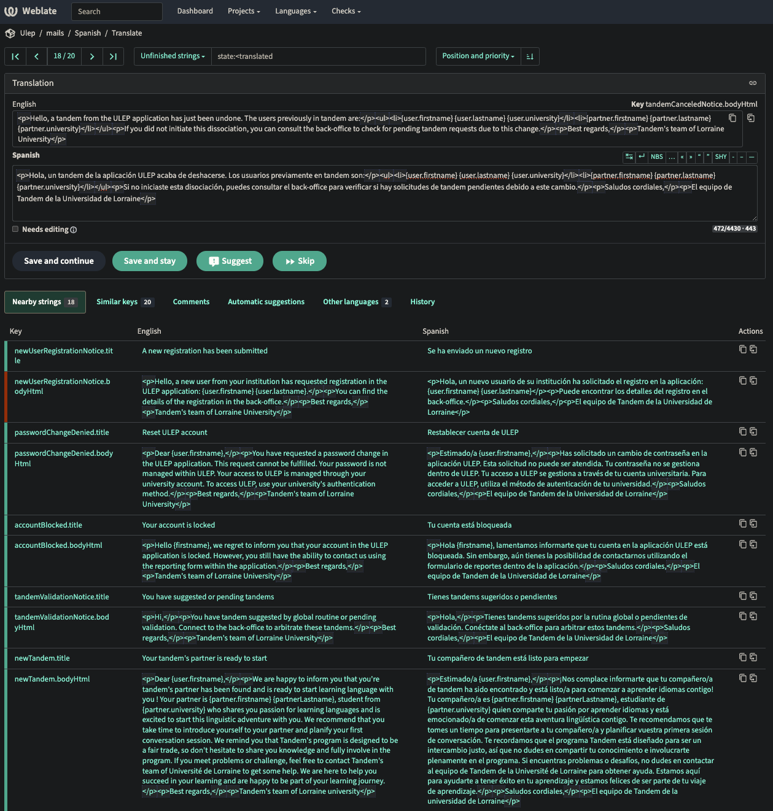
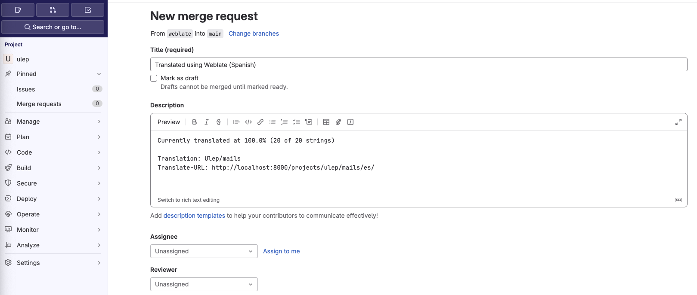

# Set Up Continuous Translations with Weblate

Weblate is a powerful, free, and open-source web-based translation management system designed to streamline the translation process for projects of any size. Developed in Python and leveraging the Django framework, Weblate offers a user-friendly interface for managing translations with efficiency and ease.

## Installation

Setting up your translation workflow in Weblate involves configuring projects and components—a project represents your overall translation project, while components are specific elements within the project related to translation files in various formats.

### Step 1: Create a Project

- Navigate to the Weblate dashboard.
- Select the option to create a new project.
- Fill in the required fields, including the project name, an optional homepage URL, and the source language.

### Step 2: Configure Repository Access

1. In your newly created project, find and copy the provided SSH public key.

2. On GitLab, go to your project's settings, then navigate to `Repository` > `Deploy keys` and paste the copied SSH key.

> [!WARNING]
> Ensure you grant write permissions to enable Weblate to push changes to your repository.

### Step 3: Create a Component

- Within your Weblate project, create a new component.

- Select the type of component you want to create.

- Complete the setup by defining the rules for how Weblate should fetch, parse, and commit translation files back to your repository.

## Translation Process

After setting up your project and components, you can begin the translation process.

### Adding a New Language

1. Navigate to your component's page.
2. Click on the + button to add a new language.
3. From the list, select the language you wish to add to your component for translation.

### Translating Content

To start translating, go to your component, select a language, and click on the `translate` button.

### Pushing Translations to Your Repository
Once you've completed translating, you'll want to push your changes back to your repository.

1. Navigate to your component and select `manage` > `Repository maintenance`.
2. Commit your changes by clicking on `Commit`.
3. Push the committed changes to your repository by selecting `Push`.
4. Create a merge request on GitLab.

