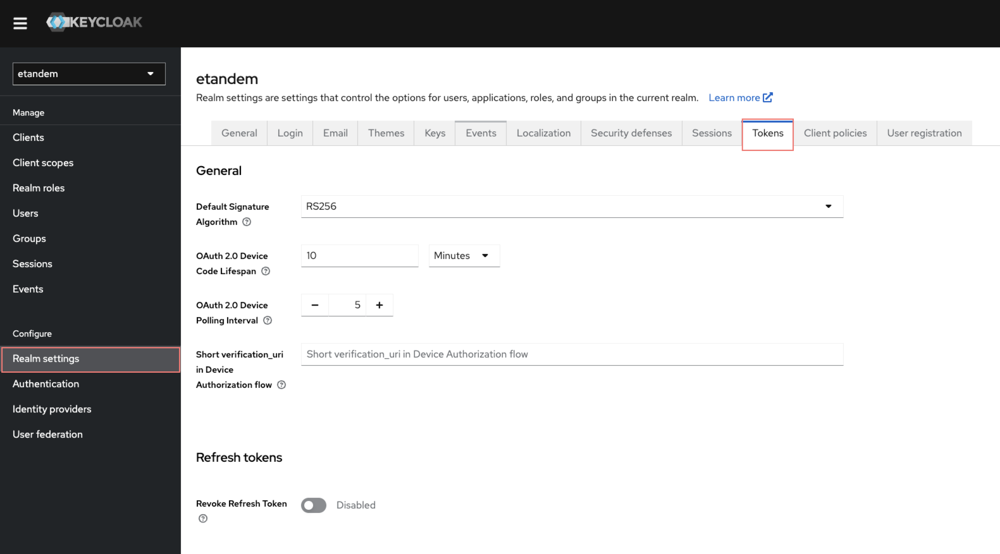
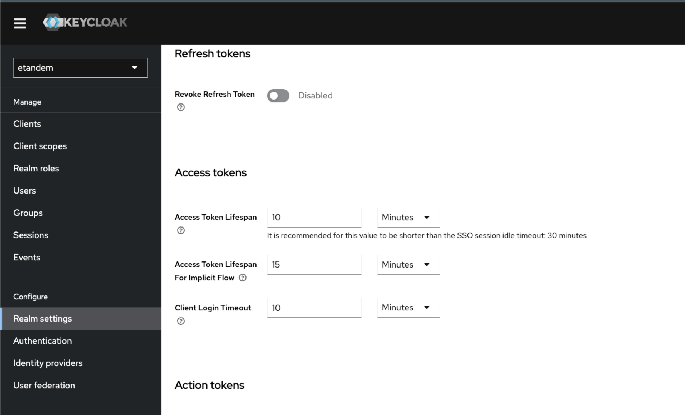
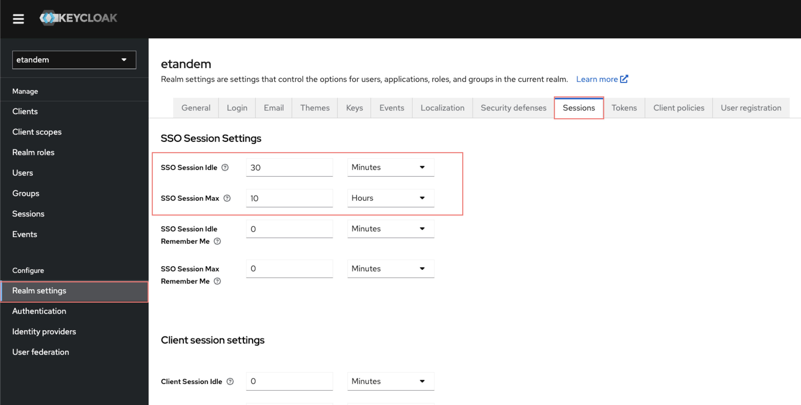
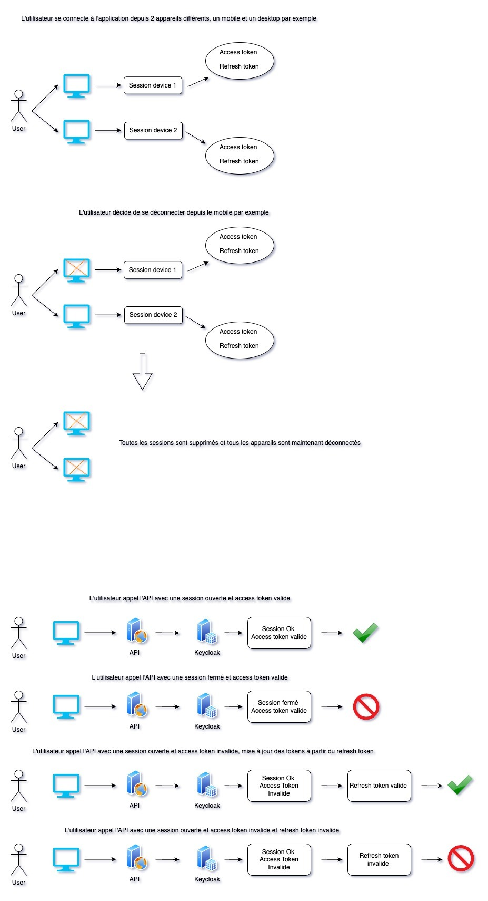

**Keycloak** est un outil de gestion des identités et des accès Open Source.

Une session correspond à un appareil connecté (exemple: mobile ou desktop).
Un jeton d'accès (access token) permet à l'application d'appeler l'api en étant authentifié à l'application.
Un jeton de rafraichissement (refresh token) permet pour une session donné d'obtenir un nouveau jeton d'accès lorsqu'il est périmé.

Afin de modifier les paramètres **Keycloak** concernant les **jetons**, veuillez accéder à l'interface d'administration puis **Realm settings > Tokens**

## Jeton d'accès
Le temps maximum avant l'expiration d'un jeton d'accès est défini à 10 minutes. Il est recommandé que cette valeur soit courte par rapport au délai d'expiration du SSO. Vous pouvez modifier le temps de validité du jeton depuis le paramètre suivant : 

Afin de modifier les paramètres **Keycloak** concernant les **sessions**, veuillez accéder à l'interface d'administration puis **Realm settings > Sessions**

## Jeton de rafraichissement 

* Si SSO Session Max > SSO Session Idle. Dans ce cas, la durée de vie du jeton d'actualisation est la même que SSO Session Idle. Pourquoi? car si l'application est inactive pendant la durée d'inactivité de la session SSO, l'utilisateur se déconnecte et c'est pourquoi le jeton d'actualisation est lié à cette valeur. Chaque fois que l'application demande un nouveau jeton, la durée de vie du jeton d'actualisation et les valeurs du compte à rebours d'inactivité de session SSO seront à nouveau réinitialisées ;
* Si SSO Session Max <= SSO Session Idle, la durée de vie du jeton d'actualisation sera la même que celle de SSO Session Max. Pourquoi? car, peu importe ce que fait l'utilisateur (c'est-à-dire inactif ou non), l'utilisateur se déconnecte après la durée maximale de la session SSO, et donc la raison pour laquelle le jeton d'actualisation est lié à cette valeur.

## Gestion des sessions et des tokens depuis les applications :

